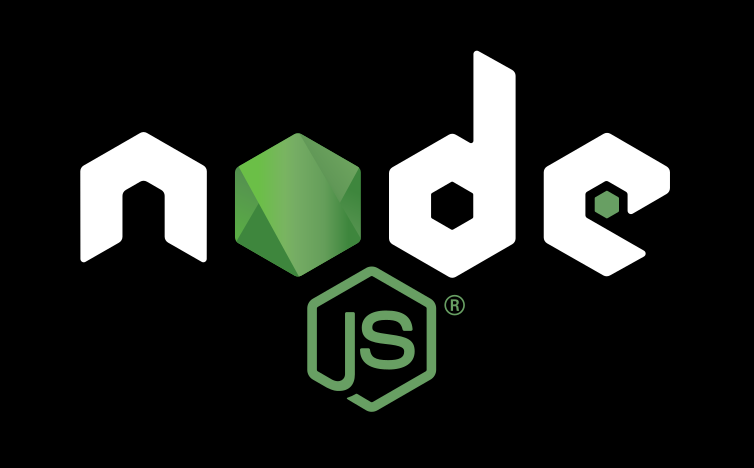

# What is Node.js?

(From [Node.js Github - Readme](https://github.com/nodejs/node)):

Node.js is a JavaScript runtime built on Chrome's V8 JavaScript engine. Node.js uses an event-driven, non-blocking I/O model that makes it lightweight and efficient. The Node.js package ecosystem, [npm][], is the largest ecosystem of open source libraries in the world.

The Node.js project is supported by the [Node.js Foundation](https://nodejs.org/en/foundation/). Contributions, policies, and releases are managed under an [open governance model](https://github.com/nodejs/node/GOVERNANCE.md). We are also bound by a [Code of Conduct](https://github.com/nodejs/node/CODE_OF_CONDUCT.md).

If you need help using or installing Node.js, please use the [nodejs/help](https://github.com/nodejs/help) issue tracker.

<!--%%LOGO%%--> 



# About this image.

## Why not use the official image.

The official Node.js Image, is made extending a few building-deps images; this is ([`node:7.4`](https://github.com/nodejs/docker-node/blob/28425ed95cebaea2ff589c1516d79c60181983b2/7.4/Dockerfile)):

```dockerfile
FROM buildpack-deps:jessie
```

The [`buildpack-deps:jessie`](https://github.com/docker-library/buildpack-deps/blob/11492c68d993221fd5cd4d8a980354634fc165dd/jessie/Dockerfile) image, inherints from:

```dockerfile
FROM buildpack-deps:jessie-scm
```

The [`buildpack-deps:jessie-scm`](https://github.com/docker-library/buildpack-deps/blob/1845b3f918f69b4c97912b0d4d68a5658458e84f/jessie/scm/Dockerfile) image, inherints from:

```dockerfile
FROM buildpack-deps:jessie-curl
```

And, finally, [`buildpack-deps:jessie-curl`](https://github.com/docker-library/buildpack-deps/blob/a0a59c61102e8b079d568db69368fb89421f75f2/jessie/curl/Dockerfile) image, inherints from:

```dockerfile
FROM debian:jessie
```

In the intermediate builds, there are a few packages installed, like bzr, mercurial, subversion, git, build-essentials, and so on. This packages will be needed, or not; but it makes that the final image, is very weight (at the redaction of this document, 660,4 Mb); so, we made another option, with the minimal packages needed, and support for locale and timezone, in Debian flavour. Note that you will need some extra packages for your Node.js / MEAN application, so, extend this image and / or modify the Dockerfile as you wish.

The method to install the Node.js binaries, is download them, as in the official images.

The usage of the image, is the same as the official.


## Added support for locale and timezone.

But add extra support for configure timezone and locales before built the image, with the arguments in 
the `docker build` command (`--build-arg`), and `ARG` in the `Dockerfile`.

Default values for the timezone and locale are:

```bash
Timezone:   "Europe/Madrid"
Locale:     es_ES.UTF-8
```

# How to build this Image.

## Build a localized image.

To build a localized image, this is, a Node.js (Debian based) Image with locale and timezone correctly defined, we
have to use the `--build-arg` parameter of the `docker build` command.

An example:

```bash
docker build --build-arg TIMEZONE="Europe/France" --build-arg LOCALE_LANG_COUNTRY="fr_FR" .
```

## Locales

The locales are generated with the snippet described in Debian Official Image, and
[used in PostgreSQL Official Image](https://github.com/docker-library/postgres/blob/69bc540ecfffecce72d49fa7e4a46680350037f9/9.6/Dockerfile#L21-L24):

```dockerfile
RUN apt-get update && apt-get install -y locales && rm -rf /var/lib/apt/lists/* \
    && localedef -i en_US -c -f UTF-8 -A /usr/share/locale/locale.alias en_US.UTF-8
ENV LANG en_US.utf8
```

We only add a few arguments for the build:

```dockerfile
ARG LOCALE_LANG_COUNTRY="es_ES"
ARG LOCALE_CODIFICATION="UTF-8"
ARG LOCALE_CODIFICATION_ENV="utf8"
```

And execute the build as:


```dockerfile
    && echo "=> Configuring and installing locale (${LOCALE_LANG_COUNTRY}.${LOCALE_CODIFICATION}):" \
    && apt-get install -y locales \
    && rm -rf /var/lib/apt/lists/* \
    && localedef -i ${LOCALE_LANG_COUNTRY} -c -f ${LOCALE_CODIFICATION} -A /usr/share/locale/locale.alias ${LOCALE_LANG_COUNTRY}.${LOCALE_CODIFICATION} \
```

## Timezone

We use a snippet provided by [Oscar](https://oscarmlage.com/) (Thanks!):

```dockerfile
    echo "=> Configuring and installing timezone:" && \
        echo "Europe/Madrid" > /etc/timezone && \
        dpkg-reconfigure -f noninteractive tzdata && \
```

Only added an ARG for the build:

```dockerfile
ARG TIMEZONE="Europe/Madrid"
```

And, finally:

```dockerfile
    && echo "=> Configuring and installing timezone (${TIMEZONE}):" \
    && echo ${TIMEZONE} > /etc/timezone \
    && dpkg-reconfigure -f noninteractive tzdata \
```

Obviously, the value of the timezone has to be one of the right values:

[Change Timezone on Debian](https://wiki.debian.org/TimeZoneChanges)
[List of tz database time zones](https://en.wikipedia.org/wiki/List_of_tz_database_time_zones)


# How to use this image

## Create a `Dockerfile` in your Node.js app project

```dockerfile
FROM joserprieto/nodejs:latest
# replace this with your application's default port
EXPOSE 8888
```

You can then build and run the Docker image:

```console
$ docker build -t my-nodejs-app .
$ docker run -it --rm --name my-running-app my-nodejs-app
```

### Notes

The image assumes that your application has a file named [`package.json`](https://docs.npmjs.com/files/package.json) listing its dependencies and defining its [start script](https://docs.npmjs.com/misc/scripts#default-values).

It also assumes that you have a file named [`.dockerignore`](https://docs.docker.com/engine/reference/builder/#/dockerignore-file) otherwise it will copy your local npm modules:

```
node_modules
```

We have assembled a [Best Practices Guide](https://github.com/nodejs/docker-node/blob/28425ed95cebaea2ff589c1516d79c60181983b2/docs/BestPractices.md) for those using these images on a daily basis.

## Run a single Node.js script

For many simple, single file projects, you may find it inconvenient to write a complete `Dockerfile`. In such cases, you can run a Node.js script by using the Node.js Docker image directly:

```console
$ docker run -it --rm --name my-running-script -v "$PWD":/usr/src/app -w
/usr/src/app node:4 node your-daemon-or-script.js
```

## Verbosity

By default the Node.js Docker Image has npm log verbosity set to `info` instead of the default `warn`. This is because of the way Docker is isolated from the host operating system and you are not guaranteed to be able to retrieve the `npm-debug.log` file when npm fails.

When npm fails, it writes it's verbose log to a log file inside the container. If npm fails during an install when building a Docker Image with the `docker build` command, this log file will become inaccessible when Docker exits.

The Docker Working Group have chosen to be overly verbose during a build to provide an easy audit trail when install fails. If you prefer npm to be less verbose you can easily reset the verbosity of npm using the following techniques:

### Dockerfile

If you create your own `Dockerfile` which inherits from the `node` image you can simply use `ENV` to override `NPM_CONFIG_LOGLEVEL`.

```
FROM joserprieto/nodejs:latest
ENV NPM_CONFIG_LOGLEVEL warn
...
```

### Docker Run

If you run the node image using `docker run` you can use the `-e` flag to override `NPM_CONFIG_LOGLEVEL`.

```
$ docker run -e NPM_CONFIG_LOGLEVEL=warn node ...
```

### NPM run

If you are running npm commands you can use `--loglevel` to control the verbosity of the output.

```
$ docker run node npm --loglevel=warn ...
```